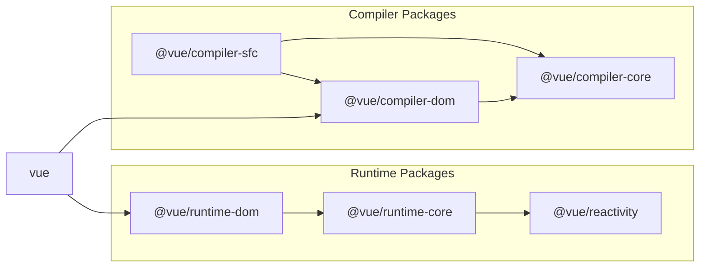

# 实现 mini-vue 核心功能

## 实现 reactivity 功能

- [reactive](./src/reactivity)
  - reactive 的实现
  - readonly 的实现
  - shallowReactive 的实现
  - shallowReadonly 的实现
  - 工具函数
    - isProxy 的实现
    - isReactive 的实现
    - isReadonly 的实现
  - [effect](./src/reactivity/effect.ts)
    - track 依赖收集
    - trigger 触发依赖
    - effect.run 的实现
    - effect.stop 的实现
    - effect.scheduler 的实现
  - [ref](./src/reactivity/ref.ts)
    - ref 的实现
    - 工具函数
      - isRef 的实现
      - toRef 的实现
      - unRef 的实现
      - proxyRefs 的实现
  - [computed](./src/reactivity/computed.ts)

## 实现 runtime-core 功能

- [createApp](./src/runtime-core/createApp.ts) 的实现
  - mount 方法的实现
- [component](./src//runtime-core/components.ts) 类型的实现
  - 初始化
    - componentInstance
  - 更新
    - diff 算法
      - 对比 props
      - 对比 children
      - 双端 Diff 和使用最长递增子序列的优化
- Text 类型的实现
- [vnode](./src/runtime-core/vnode.ts) 的实现
  - ShapeFlags 多类型
- [props](./src/runtime-core/componentProps.ts) 功能的实现
- [slots](./src/runtime-core/componentSlots.ts) 功能的实现
- 组件 setup 函数的实现
  - 返回一个对象
  - 返回一个函数作为 render
  - context 的实现
- 组件 [render](./src/runtime-core/renderer.ts) 函数的实现
- 组件代理对象的实现
- getCurrentInstance 的实现
- [依赖注入](./src/runtime-core/apiInject.ts)的实现
  - provide
  - inject
- [scheduler](./src/runtime-core/scheduler.ts) 的实现
  - nextTick 的实现
- [emit](./src//runtime-core/componentEmit.ts) 的实现

## 实现 runtime-dom 功能

- [custom-renderer](./src//runtime-dom/index.ts) 的实现
  - 渲染 api 的实现
    - createElement
    - setElementText
    - patchProp
    - insert
    - remove

## 实现 compiler-core 功能

- [parse](./src/compiler-core/parse.ts) 的实现
  - baseParse 的实现
  - AST
- [transform](./src/compiler-core/transform.ts) 的实现
  - 转换 [element](./src/compiler-core/transforms/transformElements.ts) 类型
  - 转换 [text](./src/compiler-core/transforms/transformText.ts) 类型
  - 转换 [expression](./src/compiler-core/transforms/transformExpression.ts) 类型
- [codegen](./src/compiler-core/codegen.ts) 的实现

  - generate 的实现

## 各个包的依赖关系

> https://github.com/vuejs/core/blob/main/.github/contributing.md#package-dependencies

注意：编译时的包不应该直接导入运行时导入项目，反之亦然。如果有些东西需要在编译时和运行时之间使用，则应该将其提取到@vue/shared。
